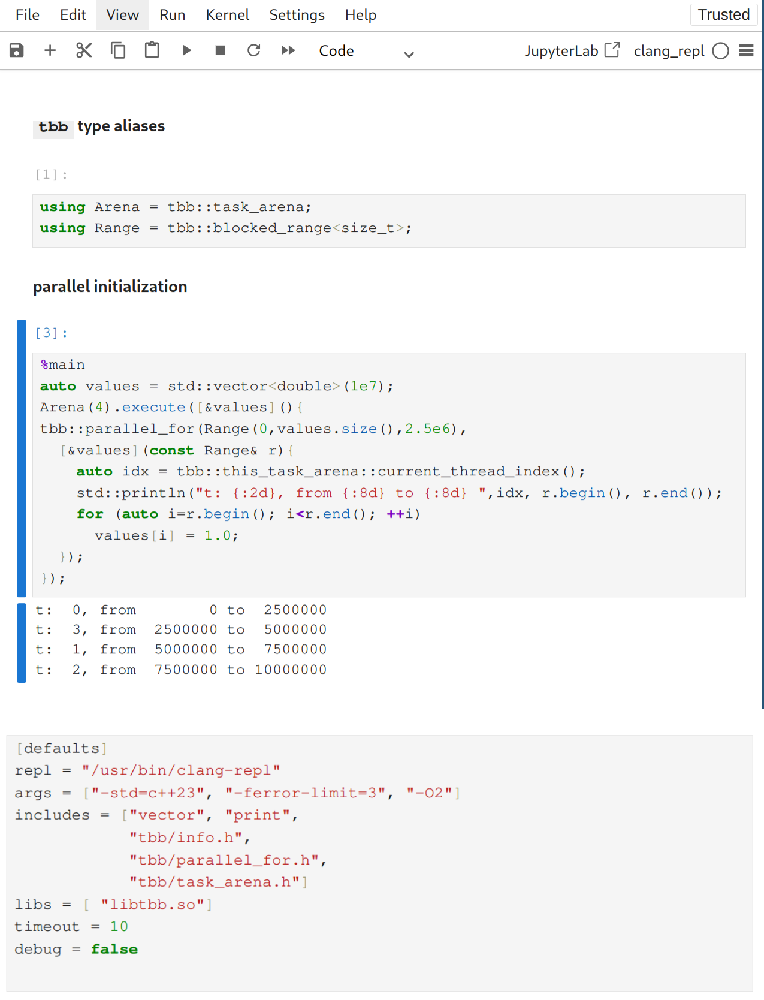

# Notebook-based learning material for modern C++

Utilizing Jupyter Notebooks is currently the dominant choice when preparing and providing lecture material and exercise handouts for Python-based programming classes; these notebooks enable 

- interleaving of documentation with code snippets,

- formatting of documentation using Markdown (including Latex-compatible rendering of formulas) and code highlighting, 

- interactive execution of code cells,

- interactive display of results,

- single-file distribution requiring only a web-browser and some common python packages on the host.

The institute's programming lectures cover Python but also C++/C: to enable a similar notebook-based setup for lecture material and exercise handouts for modern C++, we developed a notebook-kernel for C++ based directly on the interactive C++ REPL-prompt called clang-repl which is part of the LLVM project.

In contrast to existing solutions (cling, xeus-clang-repl) our kernel  

- allows using modern standards (C++23/C++26) as far as implemented for the clang compiler and standard library present on the host,

- does not require a patched LLVM build but works with the official releases available via the package manager on the host,

- allows adaption of compiler options and to create default includes and library loads via a configuration file.

The figure below shows an example notebook performing a parallel initialization of a vector and the corresponding configuration file setting up the required compiler flags, includes, and linking.

Figure: Top: Example notebook showing an interactive notebook performing a parallel initialization using the TBB library and displaying some results. Bottom: corresponding configuration file defining the REPL-prompt executable, compiler arguments, names of headers to include, and libraries to be loaded.
